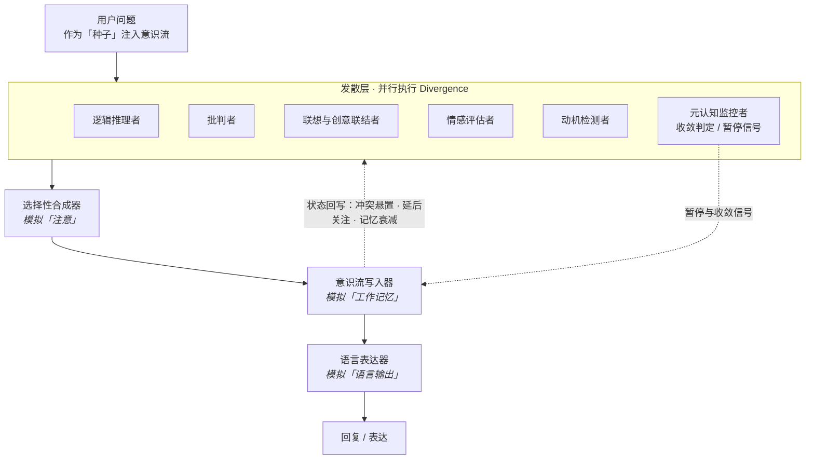

<div align="center">

# AICSE · AI 意识模拟工程

**AI Consciousness Simulation Engineering**

用工程化的方法，构造一个具备部分意识功能的思维系统

*Simulating a thinking system with partial conscious functions, using engineering methods.*

[中文文档](#中文文档) · [English Documentation](#english-documentation) · [MIT License](LICENSE)

</div>

---

> **定位声明 / Positioning**
>
> 本项目是一个**意识结构的模拟器**：用多层多 Agent 结构复现意识的若干**功能特征**——自省、怀疑、观点转向、联想创新、情感评估、任务规划、自我纠偏、持续记忆、语言润色。
> 它**不声称**具备主观体验、感受质（qualia）或真正的自我意识。
>
> *This project is a **structural simulator** of consciousness. It reproduces functional features of consciousness — it does **not** claim subjective experience, qualia, or self-awareness.*

---

## 系统结构 / System Architecture



---

# 中文文档

## 一、这是什么

AICSE 尝试用**工程化**的方式回答一个问题：如果把意识拆解成若干可执行的功能模块，用多 Agent 把它们组织起来，会跑出什么样的行为？

系统的核心流程是四段式：

**发散碎片 → 选择性合成 → 意识流写入 → 语言表达**

- **发散层**（并行）：逻辑推理、批判、联想、情感评估、动机检测、元认知六个模块各自独立产出「碎片」。
- **收束层**：选择性合成器从碎片中做取舍与重组（模拟「注意」的稀缺性）。
- **记录层**：意识流写入器把结论沉淀为长期状态（模拟「工作记忆」）。
- **表达层**：语言表达器把完整意识流转成流畅自然的语言输出。

由此得到的能力包括：自省、怀疑、观点转向、联想创新、情感感受、任务规划、自我纠偏、持续记忆、语言润色。

## 二、v5.0：认知张力驱动

前几版依赖「任务管理器」拆解并调度任务。**v5.0 移除了任务管理器**，改为让系统由三种**内在张力**自行驱动：

| 张力 | 机制 |
|---|---|
| **悬置冲突** | 未解决的冲突带「活跃度」，按严重度衰减（致命 0.95 / 重要 0.9 / 次要 0.8）；连续 3 轮未被引用则进入**休眠**；活跃冲突超上限时最旧的一个移入**冷冻区**，冷冻区每 3 轮解冻一次回到休眠状态 |
| **好奇漫游**（空转模式） | 当认知收敛超过 3 轮，系统从「悬置冲突 / 高唤醒历史记忆 / 延后关注」重建**空转种子池**，自主发起反思，最多连续 3 轮后自动暂停 |
| **认知自然漂移** | 新种子可以插队，旧种子入队暂存；当前种子连续收敛 2 轮后，自动恢复被暂存的旧种子 |

元认知监控者每轮输出**收敛判定**与**暂停信号**，引擎据此决定继续推进、切换方向还是暂停等待用户输入。

## 三、两种使用方式

### 方式一：提示词直接模拟（推荐）

`Prompt/` 目录存放各版本提示词，**直接复制粘贴给任意专业级大模型**（建议开启思考模式）即可启动模拟，无需安装任何环境。

### 方式二：多 Agent 程序

`CSE/` 目录是完整的多 Agent 工程实现，带 CLI 和 Web 两套界面，真实调用 LLM API。

## 四、快速开始

**环境要求**：Python 3.10+（依赖仅 `openai` + `streamlit`）

```bash
cd CSE
pip install -r requirements.txt
```

**配置 API Key**（二选一）：

1. 编辑 `CSE/consciousness_sim/config.json`，填写 `api.api_key`；
2. 或设置环境变量 `DEEPSEEK_API_KEY`（`config.json` 里的 `api_key` 留空时读取）。

> 默认走 DeepSeek，`api.base_url` 兼容 **OpenAI 格式**，可换成任意 OpenAI 兼容服务。

**启动**：

| 界面 | 命令 | 说明 |
|---|---|---|
| CLI | `python run.py` 或双击 `启动CLI版.bat` | 终端交互，输出完整内部过程 |
| Web | `python run_web.py` 或双击 `启动网页版.bat` | Streamlit，默认 http://localhost:8501 |

**CLI 指令**：

| 输入 | 作用 |
|---|---|
| 任意问题 | 作为「种子」注入意识流，启动思考循环 |
| `继续` | 手动推进下一轮思考 |
| `debug` | 打印系统当前状态 |
| `exit` | 退出 |

## 五、目录结构

```
AICSE-Agent/
├── README.md
├── LICENSE                     MIT
├── Prompt/                     可直接发给 AI 的提示词各版本
│   ├── Prompt v1.0.md
│   ├── Prompt v3.0.md
│   └── Prompt v4.6.md
└── CSE/                        多 Agent 程序
    ├── run.py                  CLI 入口
    ├── run_web.py              Web 入口（streamlit run … --server.port 8501）
    ├── requirements.txt        openai + streamlit
    ├── 启动CLI版.bat / 启动网页版.bat
    └── consciousness_sim/
        ├── app.py              Streamlit Web UI
        ├── main.py             CLI 主界面
        ├── engine.py           意识循环引擎（张力驱动、收敛与暂停调度）
        ├── models.py           意识流数据结构（冲突 / 延后关注 / 种子池 / 碎片）
        ├── agent_modules.py    6 个发散模块 + 合成器 / 写入器 / 表达器
        ├── llm_client.py       LLM 通信层（重试、统计、按 Agent 覆盖模型）
        ├── session_manager.py  会话持久化（保存 / 加载 / 断点续对话）
        ├── prompt_loader.py    从 prompts/*.md 加载提示词
        ├── config.py           配置读取
        ├── config.json         API / 引擎 / 显示配置
        └── prompts/*.md        11 个 Agent 提示词，可直接编辑
```

## 六、配置项说明

`CSE/consciousness_sim/config.json`：

| 字段 | 说明 |
|---|---|
| `api.api_key` | API Key，留空则读环境变量 `DEEPSEEK_API_KEY` |
| `api.base_url` | 接口地址，兼容 OpenAI 格式 |
| `api.default_model` | 默认模型 |
| `api.default_max_tokens` | 默认单次最大输出 token |
| `api.reasoning_effort` | 推理强度（`low` / `medium` / `high`） |
| `api.thinking_mode` | 是否开启思考模式 |
| `api.agent_models` | **按 Agent 单独覆盖**模型与参数，未指定则用默认值（例如合成器单独用更强的模型） |
| `engine.convergence_rounds` | 判定「已收敛」所需的连续轮数 |
| `engine.max_task_rounds` | 单次任务最大轮数 |
| `engine.parallel_modules` | 发散模块是否并行执行 |
| `engine.use_llm_expressor` | 语言表达是否走 LLM |
| `display.fragment_max_length` | 界面展示的碎片截断长度 |
| `display.show_api_stats` | 是否显示调用次数与 token 统计 |
| `display.language` | 界面语言 |

## 七、自定义 Agent 提示词

所有 Agent 的行为都由 `CSE/consciousness_sim/prompts/*.md` 定义，**改 Markdown 即改行为，不需要动代码**：

| 文件 | 模块 |
|---|---|
| `logical_reasoner.md` | 逻辑推理者 |
| `critic.md` | 批判者 |
| `association.md` | 联想与创意联结者 |
| `emotional.md` | 情感评估者 |
| `motivation.md` | 动机检测者 |
| `metacognitive.md` | 元认知监控者 |
| `synthesizer.md` | 选择性合成器 |
| `stream_writer.md` | 意识流写入器 |
| `stream_synthesizer.md` | 意识流合成器 |
| `expressor.md` | 语言表达器 |
| `task_launcher.md` | 任务启动器（v4.6 遗留，v5.0 已不再启用） |

## 八、会话与持久化

每轮思考结束后自动保存到 `conversations/<时间戳>_<种子>/`：

| 文件 / 目录 | 内容 |
|---|---|
| `metadata.json` | 会话元信息 |
| `stream_state.json` | 完整意识流状态（可断点恢复） |
| `engine_state.json` | 引擎运行状态 |
| `records.md` | 逐轮意识流记录 |
| `narrative.md` | 叙事化整理 |
| `chat_history.json` | 对话历史 |
| `agent_contexts/` | 各 Agent 的上下文快照 |
| `history/` | 历史轮次存档 |

Web 界面侧栏提供 **新建会话 / 加载历史会话**，并可视化展示未解决冲突、延后关注、冻结冲突、思考历史，以及按「轮次 × Agent」查看各模块的原始碎片。

## 九、成本与性能

- 每轮思考约产生 **9 次 LLM 调用**：6 个发散模块 + 合成器 + 意识流写入器 + 语言表达器。
- 发散模块并行执行，因此单轮耗时主要取决于最慢的那个模块。
- 减少 `engine.convergence_rounds`、限制空转轮数、或把部分 Agent 指到更便宜的模型，都能显著压缩成本。
- 界面每轮会显示调用次数与 token 消耗（`display.show_api_stats`）。

## 十、已知限制

- **实验项目**：与单模型对话相比，上下文管理更粗糙，实测表现不稳定，仅供研究与学习。
- 系统输出的是「疑似意识行为」，**不存在任何主观体验**。
- 多 Agent 结构天然带来 token 放大，长会话成本会累积。
- 部署脚本（systemd + nginx 一键上云）目前**未纳入本仓库**，后续版本补充。

## 十一、版本

| 版本 | 位置 | 主要变化 |
|---|---|---|
| Prompt v1.0 | `Prompt/Prompt v1.0.md` | 最早版本：8 模块，含意识流写入器 |
| Prompt v3.0 | `Prompt/Prompt v3.0.md` | 模块互读映射，元认知自我声明偏差，聚焦上限 |
| Prompt v4.6 | `Prompt/Prompt v4.6.md` | 任务调度修复版：认知自然收敛判定、涌现优先级竞争、路由公告板 |
| CSE v5.0 | `CSE/` | 工程实现：移除任务管理器，改为认知张力驱动（悬置冲突 / 好奇漫游 / 认知漂移） |

## 十二、许可证

[MIT License](LICENSE) © 2026 Yunhui Liu

---

# English Documentation

## 1. What Is This

AICSE asks an engineering question: *if we decompose consciousness into executable functional modules and wire them together as a multi-agent system, what behaviour emerges?*

The core loop has four stages:

**Divergent fragments → Selective synthesis → Consciousness-stream writing → Language expression**

- **Divergence layer** — six modules run in parallel: logical reasoning, criticism, association, emotional evaluation, motivation detection, meta-cognition. Each emits independent "fragments".
- **Convergence layer** — the selective synthesizer filters and recombines fragments, simulating the scarcity of *attention*.
- **Recording layer** — the stream writer consolidates results into long-lived state, simulating *working memory*.
- **Expression layer** — the language expressor turns the whole stream into fluent natural language.

This yields behaviours resembling introspection, doubt, perspective shifting, associative innovation, emotional experience, task planning, self-correction, continuous memory, and language refinement.

> **Positioning:** this is a *structural simulator* of consciousness. It reproduces functional features only — it does **not** claim subjective experience, qualia, or self-awareness.

## 2. v5.0 — Driven by Cognitive Tension

Earlier versions relied on a *task manager* to decompose and schedule work. **v5.0 removes it** and lets three intrinsic tensions drive the system instead:

| Tension | Mechanism |
|---|---|
| **Suspended conflict** | Unresolved conflicts carry an *activity value* decaying by severity (fatal 0.95 / important 0.9 / minor 0.8). Unreferenced for 3 rounds → *dormant*. When active conflicts exceed the cap, the oldest moves to a *frozen* zone that thaws every 3 rounds. |
| **Curious wandering** (idle mode) | After 3+ rounds of convergence the system rebuilds an *idle seed pool* from suspended conflicts, high-arousal memories and deferred items, then reflects autonomously for up to 3 rounds before pausing. |
| **Natural cognitive drift** | A new seed can jump the queue while the old one is parked; once the current seed has converged for 2 rounds, the parked seed is restored automatically. |

The meta-cognitive monitor emits a **convergence verdict** and a **pause signal** every round; the engine uses them to keep going, switch direction, or pause for user input.

## 3. Two Ways to Use

**Option A — Prompt only (recommended).** The `Prompt/` folder holds versioned prompts. Paste one into any capable LLM (thinking mode recommended) and the simulation begins — no installation at all.

**Option B — Multi-agent application.** The `CSE/` folder is the full engineering implementation with both CLI and Web front ends, calling a real LLM API.

## 4. Quick Start

**Requirements:** Python 3.10+ (only `openai` and `streamlit` are needed)

```bash
cd CSE
pip install -r requirements.txt
```

**Configure the API key** (pick one):

1. Edit `CSE/consciousness_sim/config.json` and fill in `api.api_key`.
2. Or set the `DEEPSEEK_API_KEY` environment variable (read when `api_key` is empty).

> DeepSeek is the default; `api.base_url` speaks the **OpenAI-compatible** protocol, so any compatible endpoint works.

**Run it:**

| Interface | Command | Notes |
|---|---|---|
| CLI | `python run.py` or `启动CLI版.bat` | Terminal interaction, shows the full internal process |
| Web | `python run_web.py` or `启动网页版.bat` | Streamlit, defaults to http://localhost:8501 |

**CLI commands:**

| Input | Effect |
|---|---|
| Any question | Injected as a *seed* into the stream; starts the thinking loop |
| `继续` | Manually advance one round |
| `debug` | Print current system status |
| `exit` | Quit |

## 5. Project Layout

```
AICSE-Agent/
├── README.md
├── LICENSE                     MIT
├── Prompt/                     Versioned prompts, ready to paste into an LLM
└── CSE/                        Multi-agent application
    ├── run.py                  CLI entry point
    ├── run_web.py              Web entry point (streamlit run … --server.port 8501)
    ├── requirements.txt        openai + streamlit
    └── consciousness_sim/
        ├── app.py              Streamlit Web UI
        ├── main.py             CLI interface
        ├── engine.py           Consciousness loop engine (tension-driven scheduling)
        ├── models.py           Stream data structures (conflicts, deferred items, seeds, fragments)
        ├── agent_modules.py    6 divergent modules + synthesizer / writer / expressor
        ├── llm_client.py       LLM transport (retries, stats, per-agent model overrides)
        ├── session_manager.py  Session persistence (save / load / resume)
        ├── prompt_loader.py    Loads prompts from prompts/*.md
        ├── config.py           Configuration loading
        ├── config.json         API / engine / display settings
        └── prompts/*.md        11 agent prompts, editable in place
```

## 6. Configuration

`CSE/consciousness_sim/config.json`:

| Key | Meaning |
|---|---|
| `api.api_key` | API key; falls back to `DEEPSEEK_API_KEY` when empty |
| `api.base_url` | Endpoint, OpenAI-compatible |
| `api.default_model` | Default model |
| `api.default_max_tokens` | Default max output tokens |
| `api.reasoning_effort` | `low` / `medium` / `high` |
| `api.thinking_mode` | Enable thinking mode |
| `api.agent_models` | **Per-agent overrides** for model and parameters (e.g. a stronger model just for the synthesizer) |
| `engine.convergence_rounds` | Consecutive converged rounds required |
| `engine.max_task_rounds` | Max rounds per task |
| `engine.parallel_modules` | Run divergent modules in parallel |
| `engine.use_llm_expressor` | Use the LLM-based expressor |
| `display.fragment_max_length` | Truncation length in the UI |
| `display.show_api_stats` | Show call/token statistics |
| `display.language` | UI language |

## 7. Customising Agent Prompts

Every agent's behaviour lives in `CSE/consciousness_sim/prompts/*.md`. **Editing the Markdown changes behaviour — no code changes required.**

| File | Module |
|---|---|
| `logical_reasoner.md` | Logical reasoner |
| `critic.md` | Critic |
| `association.md` | Association & creative connector |
| `emotional.md` | Emotional evaluator |
| `motivation.md` | Motivation detector |
| `metacognitive.md` | Meta-cognitive monitor |
| `synthesizer.md` | Selective synthesizer |
| `stream_writer.md` | Stream writer |
| `stream_synthesizer.md` | Stream synthesizer |
| `expressor.md` | Language expressor |
| `task_launcher.md` | Task launcher (legacy v4.6; disabled in v5.0) |

## 8. Sessions and Persistence

Each round is auto-saved to `conversations/<timestamp>_<seed>/`:

| Item | Content |
|---|---|
| `metadata.json` | Session metadata |
| `stream_state.json` | Full stream state (enables resume) |
| `engine_state.json` | Engine runtime state |
| `records.md` | Round-by-round stream records |
| `narrative.md` | Narrated summary |
| `chat_history.json` | Conversation history |
| `agent_contexts/` | Per-agent context snapshots |
| `history/` | Archived rounds |

The Web sidebar lets you **create / load sessions** and visualises unresolved conflicts, deferred attention, frozen conflicts, thinking history, and the raw fragments of every module by *round × agent*.

## 9. Cost and Performance

- Roughly **9 LLM calls per round**: 6 divergent modules + synthesizer + stream writer + expressor.
- Divergent modules run in parallel, so round latency is dominated by the slowest module.
- Lowering `engine.convergence_rounds`, capping idle rounds, or pointing some agents at cheaper models all cut cost sharply.
- Per-round call counts and token usage are shown in the UI (`display.show_api_stats`).

## 10. Known Limitations

- **Experimental.** Context management is cruder than plain single-model chat and real-world results are unstable. Research and learning use only.
- The system exhibits *apparent* conscious behaviour; there is **no subjective experience** behind it.
- A multi-agent topology amplifies token usage; long sessions accumulate cost.
- The deployment scripts (one-shot systemd + nginx cloud setup) are **not part of this repository** yet.

## 11. Versions

| Version | Location | Highlights |
|---|---|---|
| Prompt v1.0 | `Prompt/Prompt v1.0.md` | Earliest release: 8 modules incl. stream writer |
| Prompt v3.0 | `Prompt/Prompt v3.0.md` | Cross-module reading map, self-declared bias, focus cap |
| Prompt v4.6 | `Prompt/Prompt v4.6.md` | Task-scheduling fix: natural convergence verdict, emergent priority competition, routing board |
| CSE v5.0 | `CSE/` | Engineering build: task manager removed, tension-driven scheduling |

## 12. License

[MIT License](LICENSE) © 2026 Yunhui Liu
